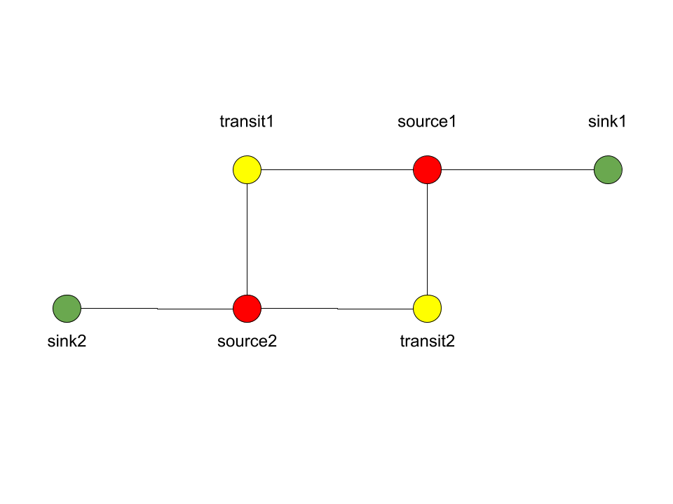

*************************************************************
Designing and prototyping your own simulation with Python3.
*************************************************************

Written by Derek Groen (Derek.Groen@brunel.ac.uk), with help from Subam Bista, Diana Suleimenova and Gebremariam Assres.

In this tutorial, you will learn how to write a basic agent-based simulation application. The example we use is a simulation that attempts to predict the movement of persons escaping dangerous areas and seeking safety. The principles we cover in this tutorial have been used for a wide range of simulations, for instance to model the escape of people from armed conflicts (https://www.nature.com/articles/s41598-017-13828-9).

The underlying technique we introduce here is more widely known as *agent-based modelling*, or ABM.

In this tutorial we will cover the following aspects:

- What is agent-based modelling in general.
- Creating a simple agent-based model with Python3 and using several of the key concepts that we used in the Flee agent-based modelling code.
- Observing uncertainty in your simulation results.
- Basic steps towards designing and prototyping your own model.

------------
Requirements
------------

To do this tutorial, you need a working Python3 installation. Numpy and pyplot are useful, but optional.

==============================
Introduction: What is agent-based modelling?
==============================

agent-based model (ABM) 
  a computational technique to model the actions and interactions of autonomous agents, with a view to assessing their effects on the system as a whole. Agents may represent individuals, groups, or abstract entities.

In this tutorial we assume that we are modelling of people moving from one place to another. However, ABM can also be used to model other movements, e.g. of objects such as cars, of animals, of cells, or even transactions or e-mails. The elements may differ on the type of model you wish to create.

In the case of our people movement simulations, we work with three basic elements:

- The persons themselves (`Person` class).
- The locations where the persons reside (`Location` class).
- And possibly the paths (or routes) that interconnect the locations (`Link` class).

In its simplest form, this agent-based model features people that reside at a
given location, and that move from one location to another as the time in the
simulation progresses.  

*Network-based versus geographically pixelated*

In general there are two widespread basic approaches to ABM. One is network-based, where each location is an agent, and the location agents are interlinked using path agents. A second approach is geographically pixelated, where a region is subdivided into square areas, and the location of agents is indicated by the respective coordinates of the corresponding square areas. It is possible to use a network-based model to approximate a geographically pixelated model, by placing all locations on Carthesian coordinates. 

-------------------
The simulation code
-------------------

What follows is a step-by-step explanation how you can use Python3 to build an agent-based simulation code. The code works as is, but as part of this tutorial you will be given the opportunity to change some of its features, so that you can make it suit your personal needs.

Imports
::
  import random

In this tutorial we use very few dependencies for the main simulation code, but the random library is an essential one, as agent-based simulations strongly rely on randomizers. We do require a few more dependencies for visualizing results, namely matplotlib, pandas, and ffmpeg for storing animations.

------------------------
Defining a single person
------------------------

We first start by defining a simple class which describes a person. Let's name
this class "Person", so that we could choose to reuse the class for other
simulation purposes.
::
  class Person:
    def __init__(self, location):
      self.ill = False
      self.injured = False
      self.x = 0.0
      self.y = 0.0
  
      self.age = 35
      self.location = location
      self.location.numAgents += 1

      # Set to true when an agent resides on a link.
      self.travelling = False
      self.distance_travelled_on_link = 0

I gave the Person class a simple constructor (see the _init_() function), which sets a number of parameters specific to the class. You can define any parameter you like, but I opted for the following (semi-arbitrary) set:

* healthy: which indicates whether a Person is generally healthy or ill/weakened.
* injured: which indicates whether a Person is physically injured or not.
* x,y: x and y GPS coordinate, to be updated as the simulation progresses.
* age: age in years.
* location: a reference to the location where the Person currently resides.
* travelling: whether the Person is currently in transit, or stationary at one of the locations.
* distance_travelled_on_link: if currently in transit, how many kilometres the person has travelled in this journey.

------------------------------------
Rules for movement and state changes
------------------------------------

Now each Person will have to make decisions at different moment. In this code,
we model two types of decisions:

1. Whether the Person wishes to move from its current location to another one.
2. If 1 is the case: which route the Person will choose from a set of routes.

We will start with decision 2, which is at the lowest level, and create a
simple function that picks a favourite route amongst a list of routes. To do
this, we created a simple weighted choice algorithm:
::
  def selectRoute(self):        
    total_score = 0.0
    for i in range(0,len(self.location.links)):
      total_score += 40000.0 / (10.0 + self.location.links[i].distance)

    selected_value = random.random() * total_score

    checked_score = 0.0
    for i in range(0,len(self.location.links)):
      checked_score += 40000.0 / (10.0 + self.location.links[i].distance)
      if selected_value < checked_score:
        return i
    

Here, each option has a weight equal to 40000 (the approximate circumference of
the planet in km) divided by (10 + [distance to the endpoint of the route in
km]).

Because the function is rather simple, I included a full implementation.
However, the exact same functionality can also be accomplished using
`numpy.random.choice()`, if you have access to the numpy library.

`selectRoute()` is embedded in a more general function (`evolve()`), which evolves
the position of a Person over a single timestep in the simulation. This
function essentially captures the mechanics in making decision 1, and relies on
the aforementioned `selectRoute()` to resolve decision 2 when necessary:
::
  def evolve(self):
  
    if not self.travelling:
      movechance = self.location.movechance
      outcome = random.random()
    
      if outcome < movechance:
        # determine here which route to take?
        chosenRoute = self.selectRoute()

        # update location to link endpoint
        self.location.numAgents -= 1
        self.location = self.location.links[chosenRoute]
        self.location.numAgents += 1
        self.travelling = True

Here the chance of a Person moving at all at a given time step is given by the
movechance. This movechance is a static number for each Location, allowing us
to set a high movechance for unsafe locations, and a lower movechance for safer
locations.

`evolve()` places Persons on the Links. To ensure that these Persons reach there
destination we create one more function, namely `finish_travel()`
::
  def finish_travel(self):
    # if the person resides on a link between locations, it is "travelling"
    if self.travelling:
    
      # increment the distance covered by 10 kilometers.
      self.distance_travelled_on_link += 10 
      
      # get the length of the current route (link).
      link_length = self.location.distance
      
      # If the distance travelled is longer than the length of the link, we arrive at our destination.      
      if self.distance_travelled_on_link > link_length:
        self.location.numAgents -= 1
        self.location = self.location.endpoint
        self.location.numAgents += 1
        self.travelling = False
        self.distance_travelled_on_link = 0

    # Update the X and Y coordinates of each agent
    if self.travelling:
        self.x = self.location.calc_x(self.distance_travelled_on_link)
        self.y = self.location.calc_y(self.distance_travelled_on_link)
    else:
      self.x = self.location.x
      self.y = self.location.y

This function allows us to track agents who are on links, and have them progress gradually.

======================
Defining the Locations
======================

Now Persons will reside at a given place, or Location. To define these places
in a networked model, we create a Location object for each place:
::
  class Location:
    def __init__(self, name, x=0.0, y=0.0, movechance=0.001):
      self.name = name
      self.x = x
      self.y = y
      self.movechance = movechance
      self.links = []
      self.numAgents = 0

The Location class, too, has a number of simple parameters. These represent essential characteristics for individual locations:

* name: the name of the Location.
* x: GPS x-coordinate, useful for placing on a map and for calculating distances as the bird flies.
* y: GPS y-coordinate.
* movechance: An indicator denoting the safety level of this location. Are people certain to stay put (0.0), certain to move out immediately (1.0) or will there be a mixture (0.0<`movechance`<1.0).
* links: An array containing routes/links/paths to other Locations.
* numAgents: A tracking variable that keeps count as to how many people are present at this Location.

==================
Defining the Links
==================

Another ingredient of our simulations is to interconnect our locations. In our network-based model it is not immediately clear that given Locations are adjacent. To define adjacencies, we create Link objects which interconnect a set of two locations:
::
  class Link:
    def __init__(self, startpoint, endpoint, distance):

      # distance in km.
      self.distance = float(distance)

      # links for now always connect two endpoints
      self.endpoint = endpoint
      self.startpoint = startpoint

      # number of agents that are in transit.
      self.numAgents = 0   
    
    def calc_x(self, d):
      dist_ratio = float (d) / float (self.distance)
      return (dist_ratio) * float(self.startpoint.x) + (1.0-dist_ratio) * float(self.endpoint.x)
    
    def calc_y(self, d):
      dist_ratio = float (d) / float (self.distance)
      return (dist_ratio) * float(self.startpoint.y) + (1.0-dist_ratio) * float(self.endpoint.y)

The Links class is accompanied with the following attributes:

* distance: The length of the link in kilometers.
* endpoint: A reference to the Location to which this Link will lead.
* numAgents: Our all-familiar tracking variable that keeps count as to how many people are in transit on this link.

It also has two functions, `calc_x()` and `calc_y()`, which calculate the GPS x and y coordinate for agents residing on a link (those that are travelling).

========================
From state to simulation
========================

We now have people, locations, and links that represent connections between
these locations. These are essential components for an agent-based model in
this context. It's easy to think up many other possible components (e.g.,
conflict events, other types of agents, more parameters regarding age, religion
etc.), but most of these are not essential for the simulation in its most basic
form. However, what is essential is to be able to model a period of time, i.e.
turning out frozen state into a simulation.

To accomplish this, we create an Ecosystem class, which stores the full state
(Locations, Links and Persons), and which is able to evolve them in time. We
define the class as follows:
::
  class Ecosystem:
    def __init__(self):
      self.locations = []
      self.locationNames = []
      self.agents = []
      self.time = 0

The Ecosystem class has the following attributes:

* locations: Contains all the locations in our system.
* locationNames: A shorthand list of the names of the respective locations in our system, to make it easier to write diagnostic information.
* agents: A list of all the agents in our system.
* time: Basically a clock, which contains the number of time steps that have been taken.

Next, we need a member function that adds locations to the Ecosystem:
::
    def addLocation(self, name, x="0.0", y="0.0", movechance=0.1):
      l = Location(name, x, y, movechance)
      self.locations.append(l)
      self.locationNames.append(l.name)
      return l

...a function that adds Agents to the Ecosystem:
::
    def addAgent(self, location):
      self.agents.append(Person(location))

...and a function that adds Links to the Ecosystem:
::
    def linkUp(self, endpoint1, endpoint2, distance="1.0"):
      """ Creates a link between two endpoint locations
      """
      endpoint1_index = 0
      endpoint2_index = 0
      for i in range(0, len(self.locationNames)):
        if(self.locationNames[i] == endpoint1):
          endpoint1_index = i
        if(self.locationNames[i] == endpoint2):
          endpoint2_index = i

      self.locations[endpoint1_index].links.append( Link(self.locations[endpoint1_index], self.locations[endpoint2_index], distance) )
      self.locations[endpoint2_index].links.append( Link(self.locations[endpoint2_index], self.locations[endpoint1_index], distance) )

Crucially, we want to evolve the system in time. This is actually done using the following function:
::
    def doTimeStep(self):
      #update agent locations
      for a in self.agents:
        a.evolve()

      #update agent travel on links
      for a in self.agents:
        a.finish_travel()

      self.time += 1

Lastly, we add two functions to aid us in writing out some results.
::
    def numAgents(self):
      return len(self.agents)

    def printLocationInfo(self):
      my_file = open("locations.csv", "w")
      my_file.write("#name,x,y\n")
      for l in self.locations:
        my_file.write("%s,%s,%s\n" % (l.name, l.x, l.y))
      my_file.close()

    def printInfo(self):
      print("Time: ", self.time, ", # of agents: ", len(self.agents))
      for l in self.locations:
        print(l.name, l.numAgents)
    
      my_file = open("agents.%s.csv" % (self.time), "w")
    
      my_file.write("#id,x,y\n")
      for id,a in enumerate(self.agents):
        my_file.write("%s,%s,%s\n" % (id, a.x, a.y))
      my_file.close()

=============================================
Creating and running a Agent-based Simulation
=============================================

We have now created all the essential classes to perform an agent-based
simulation. Here we describe how you can construct and run a simple ABM
simulation. We start off by creating an Ecosystem, and creating a location graph with six locations in it.
The location graph will roughly look like this:

And the source code required to add the locations for this involves:
::
  if __name__ == "__main__":
    print("A first ABM implementation")

    e = Ecosystem()

    l1 = e.addLocation("Source1",x=200,y=0)
    l2 = e.addLocation("Source2",x=100,y=100)
    l3 = e.addLocation("Transit1",x=100,y=0)
    l4 = e.addLocation("Transit2",x=200,y=100)
    l5 = e.addLocation("Sink1",x=300,y=0)
    l6 = e.addLocation("Sink2",x=0,y=100)

Next, we establish two paths, each of which connects the source location to one
of the two sink locations. As a test, we specify one of the paths to have a
length of 10 kilometers, and one to have a length of 5 kilometers:
::
    e.linkUp("Source1","Transit1","100.0")
    e.linkUp("Source1","Transit2","50.0")
    e.linkUp("Source2","Transit1","100.0")
    e.linkUp("Source2","Transit2","50.0")
    e.linkUp("Transit1","Sink1","200.0")
    e.linkUp("Transit2","Sink2","200.0")

With the location and links in place, we can now insert a hundred agents in the
source location l1. To do that, we use the addAgent() function a hundred times.
::
    for i in range(0,100):
      e.addAgent(location=l1)

With all the agents in place, we can now proceed to run the simulation. We first
print all the locations to a CSV file for later reference. Next, we run
the simulation for a duration of 10 time steps, and we print basic diagnostic
information after each time step:
::
    e.printLocationInfo()

    duration=10
    for t in range(0,duration):
      e.doTimeStep()
      e.printInfo()

...and with that all in place, you have just established your first working ABM
model!

==================================
Optional: Visualizing your results
==================================

*NOTE: for this section, you will need the Python3 matplotlib and pandas packages.*

To show an animation of your results, you can paste the following code into a file named `make_animation.py`.
::
  import numpy as np
  import glob
  import matplotlib.pyplot as plt
  import sys
  import pandas as pd
  from matplotlib.animation import FuncAnimation

  data_path = "example_output"

  def plot_location():
    # sample data in data directory
    location_df = pd.read_csv('%s/locations.csv' % data_path, index_col="#name")
    city_names = location_df.index.tolist()
    x = location_df.x
    y = location_df.y
    plt.scatter(x, y, s=300, alpha=0.5)
    # label the points with the city names
    for i, txt in enumerate(city_names):
      plt.annotate(txt, (x[i], y[i]), xytext=(5, 5), textcoords='offset points', fontsize='12')

  def read_csv_to_df():
    # Reads data from data directory
    df_list = []
    for file_path in glob.glob('%s/agents*.csv' % data_path):
      dataframe = pd.read_csv(file_path, index_col='#id')
      dataframe.apply(pd.to_numeric)
      df_list.append(dataframe)
    return df_list

  def animate(i, df, scat):
    scat.set_offsets(np.c_[df[i].x, df[i].y])
    return scat

  def save_animation(anim):
    """
    Requires your host system to have the "ffmpeg" pacakage installed
    For mac use home brew: brew install ffmpeg
    this will install a lot of other dependenies required as well
    """
    # Assumes output directory exists
    anim.save('%s/agent_location.mp4' % data_path)
    print('Animation saved in output directory')

  def main():
 
    if len(sys.argv)>1:
      data_path = sys.argv[1]

    fig, ax = plt.subplots(figsize=(5, 3))
    #ax.set(xlim=(-10, 110), ylim=(-10, 110))

    num_files = len(glob.glob('%s/agents*.csv' % data_path))
    scat = ax.scatter([], [])
    plot_location()

    print("# of frames: ",num_files)

    dataframe_list = read_csv_to_df()
    # time between frames can be changed by adjusting the interval param which is in milliseconds
    anim = FuncAnimation(
        fig, animate, interval=1000, frames=range(num_files), fargs=(dataframe_list, scat))

    plt.draw()
    # shows the output on screen
    plt.show()
    # uncomment line below to save as mp4 video file
    # save_animation(anim)

  if __name__ == "__main__":
    main()

Once you have done so, you can then create an animation on your screen using the command:
`python3 make_animation.py <name_of_directory_with_output_files>`
